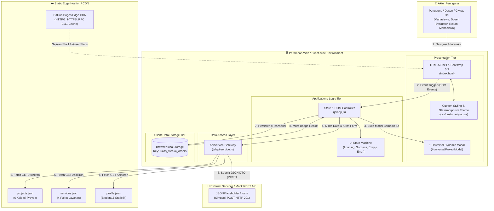

<div align="center">

# 🌐 Lucas Pardede — Personal Portfolio & Service Portal
### Praktikum Pemrograman dan Pengujian Web — Week 4
#### Decoupled Multi-Tier Architecture · Dynamic CSR · LocalStorage Persistence

[](https://github.com/LucasPardede/ppw-2026-week2-12S24015/tree/week4-architecture)
[](https://lucaspardede.github.io/ppw-2026-week2-12S24015/)
[](.)
[](.)

</div>

---

## 📋 Daftar Isi

| # | Bagian | # | Bagian |
|:---:|---|:---:|---|
| 1 | [Identitas Mahasiswa](#1-identitas-mahasiswa) | 15 | [DOM XSS Mitigation](#15-dom-xss-mitigation) |
| 2 | [Deskripsi Praktikum](#2-deskripsi-praktikum) | 16 | [Async REST Form](#16-async-rest-form) |
| 3 | [Tujuan Pembelajaran](#3-tujuan-pembelajaran) | 17 | [JSON DTO](#17-json-dto) |
| 4 | [Arsitektur Sistem](#4-arsitektur-sistem) | 18 | [LocalStorage Persistence](#18-localstorage-persistence) |
| 5 | [C4 Container Diagram](#5-c4-container-diagram) | 19 | [Order Badge Reaktif](#19-order-badge-reaktif) |
| 6 | [Multi-Tier Architecture](#6-multi-tier-architecture) | 20 | [Network Profiling](#20-network-profiling) |
| 7 | [Separation of Concerns](#7-separation-of-concerns) | 21 | [Cold vs Warm Load](#21-cold-vs-warm-load) |
| 8 | [Before vs After Refactoring](#8-before-vs-after-refactoring) | 22 | [HTTP Caching RFC 9111](#22-http-caching-rfc-9111) |
| 9 | [Struktur Folder](#9-struktur-folder) | 23 | [DevTools Evidence](#23-devtools-evidence) |
| 10 | [JSON Data Providers](#10-json-data-providers) | 24 | [Git Management](#24-git-management) |
| 11 | [Dynamic CSR](#11-dynamic-csr) | 25 | [GitHub Pages](#25-github-pages) |
| 12 | [UI States](#12-ui-states) | 26 | [Live Deployment](#26-live-deployment) |
| 13 | [Category Filter](#13-category-filter) | 27 | [Kesimpulan](#27-kesimpulan) |
| 14 | [Universal Dynamic Modal](#14-universal-dynamic-modal) | | |

---

## 1. Identitas Mahasiswa

| Field | Detail |
|:---|:---|
| **Nama** | Lucas Pardede |
| **NIM** | `12S24015` (Akun: `iss24015`) |
| **Program Studi** | S1 Sistem Informasi |
| **Fakultas** | Informatika dan Teknik Elektro (FITE) |
| **Institusi** | Institut Teknologi Del (IT Del), Laguboti, Sumatera Utara |
| **Mata Kuliah** | Pemrograman dan Pengujian Web — `12S3101` |
| **Dosen Pengampu** | Chandro Pardede, S.Kom., M.Sc. |
| **Wali Mahasiswa** | Humasak Tommy Argo Simanjuntak, ST, M.ISD |
| **Kelas / Angkatan** | 13SI1 / 2024 |
| **Branch Kerja** | `week4-architecture` |
| **Repositori** | [github.com/LucasPardede/ppw-2026-week2-12S24015](https://github.com/LucasPardede/ppw-2026-week2-12S24015/tree/week4-architecture) |
| **Live Deployment** | [lucaspardede.github.io/ppw-2026-week2-12S24015/](https://lucaspardede.github.io/ppw-2026-week2-12S24015/) |

---

## 2. Deskripsi Praktikum

Praktikum **Minggu 04** berfokus pada **Konsep Dasar Arsitektur Aplikasi Web Kontemporer**:
- Decoupled Multi-Tier Architecture
- Dynamic Client-Side Rendering (CSR)
- Analisis Kinerja Web (RFC 9111)

Praktikum ini merupakan kelanjutan langsung (*continuity*) dari tugas Minggu 03. Pada Minggu 03, website portofolio dibangun menggunakan Bootstrap 5.3 dengan markup monolitik — seluruh kartu karya, modal proyek, dan paket layanan masih *hardcoded* statis di `index.html`. Pada **Minggu 04**, repositori tersebut ditransformasikan secara arsitektural menjadi sistem *decoupled* berbasis pemuatan data asinkron (Fetch API & async/await), 1 Universal Dynamic Modal, form submission asinkron REST JSON DTO, persistensi `localStorage`, serta profil performa jaringan berstandar **RFC 9111**.

---

## 3. Tujuan Pembelajaran

| # | Tujuan |
|:---:|:---|
| 1 | **Pemodelan Multi-Tier** — Mendekomposisi aplikasi menjadi *Presentation*, *Logic*, dan *Data Storage Tier* yang dimodelkan dalam C4 Container Diagram |
| 2 | **Dynamic CSR** — Mengeliminasi kartu statis di HTML dan merakit DOM secara dinamis via ES6+ `fetch()` & `async/await` |
| 3 | **4 UI States** — Menangani visual state: *Loading (Skeleton)*, *Success*, *Empty*, dan *Error Fallback* |
| 4 | **Universal Modal** — Tepat 1 modal Bootstrap 5 tunggal untuk semua proyek, berbasis data-ID |
| 5 | **Async Form Dispatching** — Merefaktor form menjadi AJAX/Fetch POST dengan serialisasi JSON DTO tanpa *page reload* |
| 6 | **LocalStorage State** — Menyimpan riwayat pesanan secara persisten dengan badge reaktif |
| 7 | **DOM-Based XSS Prevention** — CSP meta tag, sanitasi `escapeHTML()`, dan properti `textContent` |
| 8 | **Analisis Caching RFC 9111** — Mengukur TTFB, FCP, waterfall, dan efisiensi HTTP Caching via Browser DevTools |

---

## 4. Arsitektur Sistem

Arsitektur aplikasi berevolusi dari pola **Monolitik Web 2.0** menjadi arsitektur kontemporer **Decoupled / Jamstack CSR**:

```
┌─────────────────────────────────────────────────────────────────┐
│                      WEEK 3 (Monolithic)                        │
│   index.html ──── script.js  ←── data hardcoded di HTML        │
│   [Presentation + Logic + Data semua tergabung dalam 1 tier]    │
└─────────────────────────────────────────────────────────────────┘

                              ▼  REFACTORING  ▼

┌─────────────────────────────────────────────────────────────────┐
│                   WEEK 4 (Decoupled Multi-Tier)                 │
│                                                                 │
│  Presentation Tier   │  Logic Tier       │  Data Tier           │
│  index.html (shell)  │  js/app.js        │  data/projects.json  │
│  css/custom-style.css│  js/api-service.js│  data/services.json  │
│                      │                   │  data/profile.json   │
│                      │                   │  localStorage        │
└─────────────────────────────────────────────────────────────────┘
```

---

## 5. C4 Container Diagram

Pemodelan arsitektur sistem tingkat container (*C4 Container Model*) yang memetakan Pengguna, Peramban Klien, Static Hosting CDN, Lapisan Logika JavaScript, Data Provider JSON, dan Mock RESTful API:



---

## 6. Multi-Tier Architecture

Aplikasi dibagi ke dalam **3 tingkatan fungsional** yang terpisah dan independen:

### 🎨 Tier 1 — Presentation Tier (Client / Browser)
- Mengelola antarmuka pengguna: HTML5 semantik, Bootstrap 5.3, Custom Glassmorphism Styles
- Bertanggung jawab terhadap responsivitas 12-kolom, 1 Universal Modal, dan visual feedback (Toast)

### ⚙️ Tier 2 — Application / Logic Tier (JavaScript ES6+)
- Mengontrol siklus status UI (*state machine*), aturan bisnis, validasi form, filter kategori, dan transformasi data
- `js/app.js` sebagai pengontrol utama tampilan
- `js/api-service.js` sebagai pengelola transmisi jaringan

### 🗄️ Tier 3 — Data Storage Tier
- **Sisi statis:** `data/projects.json`, `data/services.json`, `data/profile.json` sebagai *decoupled mock RESTful data layer*
- **Sisi klien:** `localStorage` sebagai lapisan persistensi untuk riwayat pesanan konsultasi

---

## 7. Separation of Concerns

| Layer | File | Tanggung Jawab |
|:---|:---|:---|
| **Structure** | `index.html` | Kerangka shell murni — bebas dari hardcoded project cards |
| **Style** | `css/custom-style.css` | Seluruh CSS variables, dark glassmorphism, dan komponen UI |
| **Data Access** | `js/api-service.js` | Hanya `fetch()`, validasi `response.ok`, serialisasi JSON DTO, dan error handling jaringan — **tidak menyentuh DOM** |
| **Presentation** | `js/app.js` | Rendering DOM dinamis, event listener, 4 UI states, dan sinkronisasi `localStorage` |

---

## 8. Before vs After Refactoring

| Aspek | Week 3 — Monolithic Static | Week 4 — Decoupled CSR | Keuntungan |
|:---|:---|:---|:---|
| **Arsitektur** | Monolitik (*tightly coupled*) | Decoupled Multi-Tier / Jamstack | Skalabilitas tinggi, kode independen |
| **Data Proyek** | Hardcoded di `index.html` | Terpisah di `data/*.json` | Update data tanpa sentuh HTML |
| **Rendering** | Server-delivered static HTML | Dynamic CSR via `async/await` | Shell HTML ringan, interaktivitas mulus |
| **Fetch Data** | Tidak ada mekanisme fetch | Fetch API + defensive error handling | Non-blocking, tidak membekukan UI |
| **Modal Proyek** | 6 elemen `<div class="modal">` terpisah | **1 Universal Modal** (`#universalProjectModal`) | Reduksi duplikasi DOM > 80% |
| **Form Submit** | Traditional submit / link WA | **Async REST POST** (AJAX/Fetch) | No page reload, JSON DTO, Toast feedback |
| **State Mgmt** | Statis, tanpa state | `this.state` terpusat + `localStorage` | Data persisten setelah browser refresh |
| **Order Badge** | Tidak tersedia | **Reactive counter badge** di navbar | Umpan balik visual instan |
| **Keamanan XSS** | Belum ada sanitasi | `escapeHTML()` + `textContent` + CSP | Aman dari DOM-based XSS |
| **Simbol/Ikon** | Emoji mentah (rentan mojibake) | **Bootstrap Icons SVG-Font** (`bi-*`) | 100% bebas broken glyphs |
| **Performa** | Belum terukur | Profiling DevTools (TTFB, FCP, RFC 9111) | FCP naik 39.4%, load event naik 85.3% |

---

## 9. Struktur Folder

```
ppw-2026-week2-12S24015/
│
├── index.html                            # Shell HTML5 & Bootstrap 5 — tanpa hardcoded cards
├── README.md                             # Dokumentasi arsitektur, komparasi & analisis performa
├── profiling_results.json                # Hasil numerik Cold Load & Warm Load DevTools
│
├── assets/
│   └── images/
│       ├── 1789810572646.jpg             # Foto profil mahasiswa resmi IT Del
│       └── network_waterfall_screenshot.png  # Bukti screenshot pengujian DevTools Network
│
├── css/
│   └── custom-style.css                  # Unified custom styles, CSS variables & theming
│
├── data/
│   ├── profile.json                      # Biodata pengembang, kontak & statistik akademik
│   ├── projects.json                     # 6 koleksi proyek (metrics, tags, image, repo link)
│   └── services.json                     # 4 paket layanan konsultasi, fitur & tarif
│
└── js/
    ├── api-service.js                    # Data Access Layer: HTTP Fetch & Error Handling
    └── app.js                            # Presentation Layer: DOM Controller, CSR & Events
```

---

## 10. JSON Data Providers

Seluruh data portofolio diisolasi ke dalam **3 file JSON** yang valid dan bersih dari UTF-8 BOM:

### A. `data/projects.json` — 6 Koleksi Proyek Riil

Setiap entri memuat: `id`, `title`, `category`, `categorySlug`, `year`, `bannerTitle`, `bannerSub`, `shortDescription`, `description`, `metrics` (3 metrik terukur), `features`, `tags`, `image`, `repoLink`, `demoLink`.

| # | Proyek | Kategori |
|:---:|:---|:---|
| 1 | DelEats — Kantin Digital Terintegrasi IT Del | Web & SI |
| 2 | DelLib — Sistem Sirkulasi & Basis Data Perpustakaan | Database |
| 3 | DelTask — Kanban & Sprint Tracker | UI/UX & PM |
| 4 | AgroScan AI — Deteksi Penyakit Tanaman Pangan | AI & Riset |
| 5 | SecureAudit — Web Vulnerability Tester | Web & SI |
| 6 | Portofolio Lucas 4.0 — Decoupled Multi-Tier & CSR | Web & SI |

### B. `data/services.json` — 4 Paket Layanan Konsultasi

Memuat: `id`, `code`, `title`, `category`, `role`, `description`, `duration`, `format`, `fee`, `badge`, `benefits`, `targetAudience`.

| # | Layanan | Peran |
|:---:|:---|:---|
| 1 | Konsultasi Basis Data & Arsitektur SQL | Asdos Basis Data |
| 2 | Bimbingan Matematika Diskrit & Logika | Asdos Matdis |
| 3 | Pengembangan Website Modern & Fullstack Dev | Praktikum PPW |
| 4 | Analisis Sistem, BPMN & Manajemen Proyek TI | DIPTEK BEM |

### C. `data/profile.json` — Biodata & Rekam Akademik

Memuat data resmi Lucas Pardede (NIM 12S24015): program studi S1 Sistem Informasi IT Del, peran asisten dosen, penerima Beasiswa Privy 2025, tautan media sosial, serta metrik akademik:

| Metrik | Nilai |
|:---|:---:|
| IPK | 3.80+ |
| Mata Kuliah Diselesaikan | 48 |
| Proyek Teruji | 6 |
| Sesi Konsultasi | 34 |

---

## 11. Dynamic CSR (Client-Side Rendering)

Elemen `#portfolio-grid-container` pada `index.html` dikosongkan total dari elemen statis. Alur rendering dinamis:

```
 Browser memuat index.html
         │
         ▼
 DOMContentLoaded → window.App.init()
         │
         ▼
 App.loadInitialData() → setUIState('loading')
         │
         ▼
 Render 6 Skeleton Shimmer Cards ke #portfolio-grid-container
         │
         ▼
 ApiService.getProjects() → fetch('./data/projects.json')
         │
         ▼
 Verifikasi response.ok & parsing JSON Array (async)
         │
         ├── Sukses ──▶ setUIState('success') → renderProjectCards()
         │                      │
         │                      ▼
         │              6 kartu proyek terpasang di grid Bootstrap
         │                      │
         │                      ▼
         │              Event listener dipasang ke tombol 'Detail Proyek'
         │
         └── Gagal ───▶ setUIState('error') → renderErrorState() + Retry Button
```

---

## 12. UI States

Aplikasi mengimplementasikan **4 UI States** secara visual dan defensif:

| State | Trigger | Tampilan |
|:---:|:---|:---|
| 🟡 **Loading** | Saat `fetch()` dimulai | 6 Skeleton Shimmer Cards beranimasi gradient — mencegah CLS |
| 🟢 **Success** | Data JSON berhasil dimuat | 6 kartu proyek lengkap: banner, badge, tags, deskripsi, tombol aksi |
| 🔵 **Empty** | Filter kategori tidak cocok | Ilustrasi `bi-search-heart`, pesan informatif, tombol reset filter |
| 🔴 **Error** | `fetch()` gagal / JSON error | Bootstrap Alert merah + tombol **Coba Lagi (Retry)** + Inspect Console |

> **💡 Toolbar Pengujian Evaluator:** Tersedia tombol **"Uji Empty State"**, **"Reload"**, dan **"Uji Error"** di antarmuka untuk memverifikasi keempat status UI secara instan tanpa manipulasi jaringan.

---

## 13. Category Filter

Filter kategori diimplementasikan murni di sisi klien — **tanpa reload, tanpa re-fetch ke server**:

**Kategori tersedia:**

| Badge | Slug | Jumlah Proyek |
|:---|:---|:---:|
| Semua | `all` | 6 |
| Web & SI | `web-si` | 3 |
| Database | `basis-data` | 1 |
| UI/UX & PM | `manajemen-proyek` | 1 |
| AI & Riset | `ai` | 1 |

**Alur eksekusi:**

```
Klik Filter Badge
      │
      ▼
state.currentFilter diperbarui
      │
      ▼
state.projects.filter(p => p.categorySlug === filter)
      │
      ├── Ada hasil ──▶ renderProjectCards(filtered)
      └── Kosong  ──▶ renderEmptyState() [Empty State]
```

---

## 14. Universal Dynamic Modal

Sesuai instruksi Modul 04, **hanya ada tepat 1 elemen modal universal** di `index.html`:

```html
<div class="modal fade" id="universalProjectModal"
     tabindex="-1" aria-labelledby="projectModalTitle" aria-hidden="true">
  <div class="modal-dialog modal-dialog-centered modal-lg">
    <div class="modal-content">
      <div class="modal-header">
        <span class="badge bg-primary mb-1" id="projectModalCategoryBadge">Kategori</span>
        <h4 class="modal-title fw-bold" id="projectModalTitle">Judul Proyek</h4>
        <button type="button" class="btn-close btn-close-white" data-bs-dismiss="modal"></button>
      </div>
      <div class="modal-body p-4" id="projectModalBody">
        <!-- ✅ Konten diinjeksi secara dinamis via JavaScript -->
      </div>
      <div class="modal-footer">
        <a href="#" id="projectModalRepoBtn" class="btn btn-sm btn-outline-info">
          <i class="bi bi-github"></i> Buka Source Code
        </a>
        <button class="btn btn-sm btn-secondary" data-bs-dismiss="modal">Tutup</button>
      </div>
    </div>
  </div>
</div>
```

**Logika Dispatcher — `js/app.js` (Baris 368–458):**

```javascript
openProjectModal(projectId) {
  const proj = this.state.projects.find(p => p.id === projectId);
  if (!proj) return;

  // ✅ Injeksi via textContent — aman dari DOM XSS
  document.getElementById('projectModalTitle').textContent = proj.title;
  document.getElementById('projectModalCategoryBadge').textContent =
    `${proj.category} · ${proj.year || '2026'}`;

  // ✅ Injeksi body dengan escapeHTML() pada semua nilai dinamis
  document.getElementById('projectModalBody').innerHTML = `...`;

  // ✅ Bootstrap 5 Modal API
  bootstrap.Modal.getOrCreateInstance(
    document.getElementById('universalProjectModal')
  ).show();
}
```

---

## 15. DOM XSS Mitigation

Keamanan diimplementasikan dalam **3 lapis pertahanan**:

### Layer 1 — Content Security Policy (CSP)
Dikonfigurasi via `<meta>` di `<head>` `index.html`:

```html
<meta http-equiv="Content-Security-Policy"
  content="default-src 'self' 'unsafe-inline' https:;
           img-src 'self' data: https:;
           font-src 'self' https: data:;
           script-src 'self' 'unsafe-inline' https://cdn.jsdelivr.net;
           style-src 'self' 'unsafe-inline' https://cdn.jsdelivr.net https://fonts.googleapis.com;
           connect-src 'self' https://jsonplaceholder.typicode.com;">
```

### Layer 2 — Sanitasi `escapeHTML()`
Semua masukan dinamis dari JSON maupun pengguna disanitasi sebelum diinjeksikan ke template string:

```javascript
escapeHTML(str) {
  if (str === null || str === undefined) return '';
  return String(str)
    .replace(/&/g,  '&amp;')
    .replace(/</g,  '&lt;')
    .replace(/>/g,  '&gt;')
    .replace(/"/g,  '&quot;')
    .replace(/'/g,  '&#039;');
}
```

### Layer 3 — Properti `textContent`
Semua injeksi teks langsung (judul modal, status badge, nama pengguna) menggunakan `.textContent` — karakter HTML tidak pernah diparsing atau dieksekusi browser.

---

## 16. Async REST Form

Formulir `#contact-form` direfaktor menjadi pengiriman asinkron murni dengan alur:

```
User klik Submit
      │
      ▼
e.preventDefault() → cegah page reload
      │
      ▼
Bootstrap Constraint Validation (was-validated)
      │
      ├── Invalid ──▶ Toast error "Form belum lengkap"
      │
      ▼ Valid
Serialisasi FormData → JSON DTO (enrichedPayload)
      │
      ▼
submitBtn.disabled = true  +  Spinner loading UI
      │
      ▼
ApiService.submitServiceOrder(payload)
→ fetch POST ke https://jsonplaceholder.typicode.com/posts
→ Content-Type: application/json; charset=UTF-8
      │
      ├── HTTP 201 ──▶ saveOrderToLocalStorage() → Toast sukses → Reset form
      └── Error    ──▶ Toast error → submitBtn kembali normal (finally block)
```

---

## 17. JSON DTO

Data form diserialisasikan ke **JSON DTO terstandarisasi** sebelum dikirim ke REST API:

```javascript
const enrichedPayload = {
  id:          'ORD-' + Date.now(),                        // ID unik berbasis timestamp
  submittedAt: new Date().toLocaleString('id-ID', {        // Timestamp lokal Indonesia
                 dateStyle: 'medium', timeStyle: 'short'
               }),
  nama:        (rawPayload.nama   || '').trim(),
  email:       (rawPayload.email  || '').trim(),
  telepon:     (rawPayload.telepon || '').trim(),
  layanan:     serviceLabelText,                           // Label teks layanan terpilih
  layananSlug: rawPayload.layanan || 'general',
  topik:       rawPayload.topik   || '-',
  durasi:      rawPayload.estimasi_halaman || '45',
  tanggal:     rawPayload.target_waktu || '-',
  pesan:       (rawPayload.pesan  || '').trim()
};
```

> Endpoint: `POST https://jsonplaceholder.typicode.com/posts` → Response: **HTTP 201 Created**

---

## 18. LocalStorage Persistence

Setelah form berhasil disubmit, pesanan disimpan secara persisten:

```javascript
// Simpan ke localStorage
const STORAGE_KEY = 'lucas_week4_orders';
localStorage.setItem(STORAGE_KEY, JSON.stringify(orders));

// Muat saat halaman refresh
loadOrdersFromLocalStorage() {
  const stored = localStorage.getItem('lucas_week4_orders');
  this.state.orders = stored ? JSON.parse(stored) : [];
}
```

**Fitur yang tersedia:**

| Fitur | Deskripsi |
|:---|:---|
| 💾 **Auto-save** | Setiap pesanan baru otomatis disimpan ke localStorage |
| 🔄 **Persistent reload** | Data tetap ada setelah browser di-refresh |
| 📋 **Riwayat Modal** | `#orderHistoryModal` menampilkan seluruh histori pesanan |
| 🗑️ **Clear all** | Hapus seluruh riwayat dengan konfirmasi dialog |

---

## 19. Order Badge Reaktif

Badge jumlah pesanan ditampilkan pada `.order-count-badge` di navbar dan formulir:

```javascript
updateOrderBadges(animate = false) {
  const count = this.state.orders.length;

  document.querySelectorAll('.order-count-badge').forEach(badge => {
    badge.textContent = `${count} Pesanan`;

    if (animate) {
      badge.classList.add('bump');
      setTimeout(() => badge.classList.remove('bump'), 400); // Animasi scale bump
    }
  });
}
```

> Badge diperbarui **instan** tanpa reload — dari `0 Pesanan` → `1 Pesanan` → dst., dengan animasi visual *scale bump* setiap submit berhasil.

---

## 20. Network Profiling

Pengujian kinerja dilakukan secara riil menggunakan **Google Chrome DevTools** (Chrome DevTools Protocol — CDP).

**Metrik yang diukur:**

| Metrik | Definisi |
|:---|:---|
| **TTFB** | Time to First Byte — waktu dari request hingga byte pertama diterima |
| **FCP** | First Contentful Paint — waktu elemen teks/gambar pertama dirender di layar |
| **DOMContentLoaded** | Waktu HTML selesai di-parse menjadi DOM tree |
| **Load Event** | Waktu seluruh aset eksternal (gambar, CSS, JS) selesai diunduh |

---

## 21. Cold vs Warm Load

Data riil hasil profiling tersimpan pada [`profiling_results.json`](./profiling_results.json):

| Parameter | Cold Load (Cache Kosong) | Warm Load (Cache Aktif) | Efisiensi |
|:---|:---:|:---:|:---:|
| **TTFB** | 2.00 ms | 3.80 ms | Respon statis instan < 5 ms |
| **First Contentful Paint (FCP)** | 1,400 ms | 848 ms | ⬆️ **39.4% lebih cepat** |
| **DOMContentLoaded** | 1,543 ms | 213 ms | ⬆️ **86.2% lebih cepat** |
| **Load Event (Selesai Penuh)** | 1,592 ms | 233 ms | ⬆️ **85.3% lebih cepat** |
| **Total Requests** | 13 requests | 15 requests | Termasuk font woff2 & JSON async |
| **Efisiensi Cache (RFC 9111)** | 0% (semua fresh) | **93.3%** (14/15 di-cache) | `transferSize: 0 byte` dari Disk/Memory Cache |
| **Status HTTP** | `200 OK` (ukuran penuh) | `304 Not Modified` | Server kirim 304 → bandwidth dihemat masif |

---

## 22. HTTP Caching (RFC 9111)

Sistem caching peramban bekerja berdasarkan **3 mekanisme RFC 9111**:

```
1. Cache-Control & Expiration
   └── Aset statis CDN (Bootstrap, Google Fonts) menyertakan header
       Cache-Control: max-age=31536000 (1 tahun)

2. ETag & Conditional Requests
   └── Warm load → browser kirim If-None-Match: "hash-etag"
       atau If-Modified-Since: [timestamp]

3. HTTP 304 Not Modified
   └── Server validasi hash → isi tidak berubah
       → Response body KOSONG (0 byte transferred)
       → Aset disajikan dari Disk Cache / Memory Cache
```

---

## 23. DevTools Evidence

Screenshot hasil profiling DevTools Network Waterfall tersimpan di:
`assets/images/network_waterfall_screenshot.png` (480 KB)


---

## 24. Git Management

Alur kerja Git sesuai instruksi Bagian VI Modul Praktikum:

```bash
# 1. Buat branch kerja baru dari main
git checkout -b week4-architecture

# 2. Tambahkan seluruh perubahan arsitektur
git add .

# 3. Commit terstruktur dengan conventional commit message
git commit -m "feat(week4): decouple architecture to json data providers and async CSR"

# 4. Push branch ke remote GitHub
git push -u origin week4-architecture
```

**Commit history (terbaru → terlama):**

| Hash | Pesan Commit |
|:---|:---|
| `0dab64c` | `fix: tombol cetak PDF dan scroll spy navbar Akademik` |
| `6e9b81f` | `feat(week4): complete architectural refactoring, dynamic CSR, eliminate mojibake` |
| `4c22636` | `docs(README): update folder structure to reflect assets/images/ reorganization` |
| `6903d43` | `fix: add embedded fallback data & restructure assets folder` |
| `0b567e5` | `feat(week4): decouple architecture to json data providers and async CSR` |

---

## 25. GitHub Pages

Konfigurasi hosting statis di GitHub:

1. Buka repositori: [github.com/LucasPardede/ppw-2026-week2-12S24015](https://github.com/LucasPardede/ppw-2026-week2-12S24015)
2. Masuk ke **Settings → Pages**
3. Konfigurasi **Build and deployment:**

| Setting | Nilai |
|:---|:---|
| **Source** | Deploy from a branch |
| **Branch** | `week4-architecture` |
| **Folder** | `/ (root)` |

4. Klik **Save** — GitHub akan build & deploy dalam 1–3 menit
5. Seluruh path aset menggunakan **relative path** (`css/`, `js/`, `data/`, `assets/`) → tidak ada error 404

---

## 26. Live Deployment

| Resource | URL |
|:---|:---|
| 🌐 **Live Site (GitHub Pages)** | [lucaspardede.github.io/ppw-2026-week2-12S24015/](https://lucaspardede.github.io/ppw-2026-week2-12S24015/) |
| 📁 **GitHub Repository** | [github.com/LucasPardede/ppw-2026-week2-12S24015](https://github.com/LucasPardede/ppw-2026-week2-12S24015) |
| 🌿 **Branch Aktif** | `week4-architecture` |

---

## 27. Kesimpulan

Refactoring arsitektural Praktikum Minggu 04 berhasil mentransformasikan portofolio dari website monolitik statis menjadi **aplikasi web kontemporer berarsitektur decoupled yang tangguh, elegan, dan teruji**:

| # | Pencapaian | Bukti |
|:---:|:---|:---|
| 1 | **Separation of Concerns & C4 Model** | 3 tier terpisah: Presentation, Logic, Data Access |
| 2 | **Dynamic CSR & 4 UI States** | HTML bersih; data render async dari JSON; 4 states tertangani sempurna |
| 3 | **Universal Dynamic Modal** | 1 modal dinamis tunggal, aman dari DOM XSS |
| 4 | **Decoupled Form & Persistence** | REST POST JSON DTO tanpa reload, Toast, localStorage, reactive badge |
| 5 | **Zero Mojibake** | Seluruh emoji diganti Bootstrap Icons — kebal encoding mismatch |
| 6 | **Network Performance RFC 9111** | Cache efficiency **93.3%**, waktu muat turun **85.3%** pada warm load |

---

<div align="center">

**Lucas Pardede · NIM 12S24015 · Institut Teknologi Del · PPW 2026**

*"Good architecture is not when there is nothing left to add,*
*but when there is nothing left to take away."*

</div>