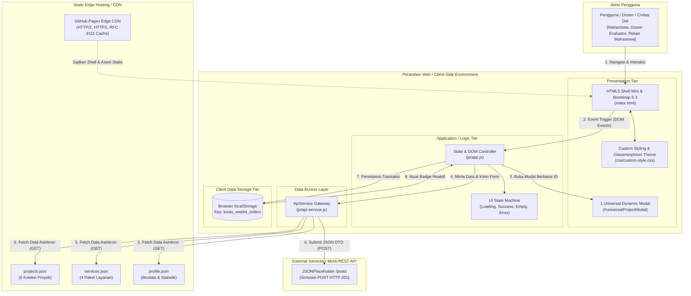
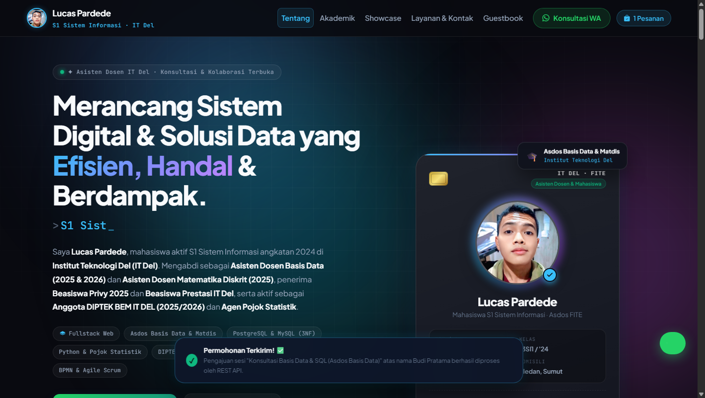

# PPW Week 4
## Personal Portfolio & Service Portal

---

## 1. Identitas

* **Nama Mahasiswa:** Lucas Pardede
* **NIM:** 12S24015 (Akun Mahasiswa: `iss24015`)
* **Program Studi:** S1 Sistem Informasi
* **Fakultas:** Fakultas Informatika dan Teknik Elektro (FITE)
* **Institusi:** Institut Teknologi Del (IT Del), Laguboti, Sumatera Utara
* **Mata Kuliah:** Pemrograman dan Pengujian Web (12S3101)
* **Dosen Pengampu:** Chandro Pardede, S.Kom., M.Sc.
* **Wali Mahasiswa:** Humasak Tommy Argo Simanjuntak, ST, M.ISD
* **Kelas / Angkatan:** 13SI1 / 2024
* **Nama Repositori GitHub:** `ppw-2026-week2-12S24015`
* **Cabang Kerja (Branch):** `week4-architecture`
* **Tautan Repositori:** [https://github.com/LucasPardede/ppw-2026-week2-12S24015/tree/week4-architecture](https://github.com/LucasPardede/ppw-2026-week2-12S24015/tree/week4-architecture)
* **Tautan Live Deployment:** [https://lucaspardede.github.io/ppw-2026-week2-12S24015/](https://lucaspardede.github.io/ppw-2026-week2-12S24015/)

---

## 2. Deskripsi Praktikum

Praktikum Minggu 04 berfokus pada **Konsep Dasar Arsitektur Aplikasi Web Kontemporer: Decoupled Multi-Tier, Dynamic Client-Side Rendering (CSR), dan Analisis Kinerja Web**. 

Praktikum ini merupakan kelanjutan langsung (*continuity*) dari tugas Minggu 03. Pada Minggu 03, website portofolio mahasiswa dibangun menggunakan Bootstrap 5.3 dengan markup monolitik di mana seluruh kartu karya, modal rincian proyek, dan paket layanan masih berstatus *hardcoded* statis di dalam file `index.html`. Pada Minggu 04, repositori tersebut ditransformasikan secara arsitektural menjadi sistem yang terpisah (*decoupled*), berbasis pemuatan data asinkron modern (Fetch API & async/await), 1 Universal Dynamic Modal, form submission asinkron murni berstandar REST JSON DTO, persistensi client-side `localStorage`, serta profil performa jaringan berstandar **RFC 9111**.

---

## 3. Tujuan

1. **Pemodelan Multi-Tier Kontemporer:** Mendekomposisi aplikasi web menjadi *Presentation Tier*, *Application/Service Logic Tier*, dan *Data Storage Tier* yang dimodelkan dalam Diagram C4 Container Model.
2. **Dynamic Client-Side Rendering (CSR):** Mengeliminasi kartu statis di file HTML dan merakit DOM secara dinamis di peramban menggunakan JavaScript modern ES6+ (`fetch()` dan `async/await`).
3. **Manajemen Siklus Status Antarmuka (4 UI States):** Menangani visual state secara komprehensif: *Loading State (Skeleton/Spinner)*, *Success State*, *Empty State*, dan *Error Fallback State*.
4. **Universal Dynamic Modal Component:** Mengonfigurasi tepat 1 komponen modal Bootstrap 5 tunggal untuk menyajikan rincian seluruh proyek berbasis data-ID tanpa duplikasi elemen HTML.
5. **Decoupled Asynchronous REST Form Dispatching:** Merefaktor formulir layanan menjadi mekanisme asinkron (AJAX/Fetch POST) dengan serialisasi JSON DTO tanpa memicu *full page reload*.
6. **Manajemen State Lokal Klien (localStorage):** Menyimpan riwayat pemesanan layanan secara persisten dan menyajikan indikator badge yang reaktif.
7. **Pencegahan DOM-Based XSS:** Menerapkan pertahanan berlapis dengan Content Security Policy (CSP), sanitasi string, dan properti `textContent`.
8. **Analisis Caching & Profil Kinerja (RFC 9111):** Mengukur Time to First Byte (TTFB), First Contentful Paint (FCP), hierarki Waterfall, dan efisiensi HTTP Caching (304 Not Modified) melalui Browser DevTools.

---

## 4. Arsitektur Sistem

Arsitektur aplikasi portofolio personal Lucas Pardede berevolusi dari pola Monolitik Web 1.0/2.0 menjadi arsitektur kontemporer decoupled (Jamstack & CSR). Tampilan antarmuka disajikan secara instan dari *Edge CDN*, sementara data diambil secara independen melalui kontrak data JSON. Logika tampilan, logika akses data, dan lapisan penyimpanan data terisolasi secara terstruktur.

---

## 5. C4 Container Diagram

Berikut adalah pemodelan arsitektur sistem tingkat container (*C4 Container Model*) yang memetakan Pengguna, Peramban Klien, Static Hosting CDN, Lapisan Logika JavaScript, Data Provider JSON, dan Mock RESTful API:



---

## 6. Multi-Tier Architecture

Aplikasi dibagi ke dalam 3 tingkatan fungsional terpisah:

1. **Presentation Tier (Client / Browser):**
   * Mengelola antarmuka pengguna (HTML5 semantik, Bootstrap 5.3, Custom Glassmorphism Styles).
   * Bertanggung jawab terhadap responsivitas 12-kolom, interaktivitas instan, 1 Universal Modal, dan visual feedback (Toast).
2. **Application / Service Logic Tier (JavaScript ES6+):**
   * Mengontrol siklus status UI (*state machine*), aturan bisnis, validasi masukan formulir, filter kategori instan, dan transformasi data.
   * `js/app.js` sebagai pengontrol utama tampilan dan `js/api-service.js` sebagai pengelola transmisi jaringan.
3. **Data Storage Tier:**
   * Di sisi statis: berkas `data/projects.json`, `data/services.json`, dan `data/profile.json` bertindak sebagai *decoupled mock RESTful data layer*.
   * Di sisi klien: `localStorage` berfungsi sebagai lapisan persistensi terdistribusi untuk menyimpan riwayat pesanan konsultasi.

---

## 7. Separation of Concerns (Pemisahan Minat)

* **HTML (`index.html`):** Murni kerangka struktural (*skeleton shell*). Bebas dari hardcoded cards proyek.
* **CSS (`css/custom-style.css`):** Berkas stylesheet tunggal terpadu yang memusatkan seluruh variabel CSS (*custom properties*), styling dark glassmorphism, dan komponen UI.
* **Data Access Layer (`js/api-service.js`):** Tidak menyentuh DOM sama sekali. Hanya bertanggung jawab melakukan `fetch()`, validasi HTTP `response.ok`, serialisasi JSON DTO, dan menangani error jaringan.
* **Presentation Controller (`js/app.js`):** Mengelola rendering dinamis ke DOM, mendengarkan event pengguna, mengendalikan 4 UI states, dan sinkronisasi ke `localStorage`.

---

## 8. Before vs After Refactoring

| Aspek Evaluasi | Sebelum (Minggu 03 — Monolithic Static) | Sesudah (Minggu 04 — Decoupled CSR Architecture) | Keuntungan & Dampak Arsitektural |
| :--- | :--- | :--- | :--- |
| **Arsitektur Sistem** | Monolitik statis (*tightly coupled*). | Decoupled Multi-Tier berbasis Jamstack. | Skalabilitas tinggi, pemeliharaan kode independen. |
| **Penyimpanan Data** | Tertanam mati (*hardcoded*) di dalam `index.html`. | Terpisah di folder `/data/*.json`. | Data dapat diubah/diupdate tanpa menyentuh file HTML. |
| **Paradigma Rendering** | Server-delivered static HTML. | Dynamic Client-Side Rendering (CSR) via ES6+ `async/await`. | Shell HTML awal berukuran ringan; interaktivitas mulus. |
| **Pengambilan Data** | Tidak ada mekanisme fetch. | Fetch API asinkron dengan *defensive error handling*. | Pemuatan data tanpa memblokir thread rendering peramban. |
| **Komponen Modal** | 6 elemen `<div class="modal">` terpisah untuk tiap proyek. | **Tepat 1 Universal Dynamic Modal** (`#universalProjectModal`). | Mereduksi redundansi kode DOM hingga >80%. |
| **Pengiriman Form** | Submit form tradisional / manipulasi link WA langsung. | **Asynchronous REST Form Dispatching** (AJAX/Fetch POST). | *No page reload*; pengiriman JSON DTO; feedback visual Toast. |
| **State Management** | Statis tanpa state management. | State terpusat (`this.state`) & persistensi `localStorage`. | Data pesanan tetap tersimpan setelah browser di-refresh. |
| **Indikator Pesanan** | Tidak tersedia penghitung pesanan aktif. | **Order Counter Badge reaktif** di navbar dan formulir. | Umpan balik visual instan (*immediate reactive bump*). |
| **Keamanan Klien** | Belum ada sanitasi masukan dinamis. | Sanitasi `escapeHTML()`, `textContent`, dan direktif CSP. | Aman dari kerentanan DOM-based Cross-Site Scripting (XSS). |
| **Simbol & Ikonografi** | Emoji mentah rentan mojibake (`💡`, `🎓`, `⚡`). | **Bootstrap Icons SVG-Font (`bi bi-*`)** terstandarisasi. | 100% bebas dari broken glyphs dan encoding mismatch. |
| **Kinerja Web** | Belum terukur secara objektif. | Profil DevTools komprehensif (TTFB, FCP, Caching RFC 9111). | Kinerja terukur riil: FCP naik 39.4%, load event naik 85.3%. |

---

## 9. Struktur Folder

Struktur folder terstandarisasi sesuai modul Minggu 04:

```text
ppw-2026-week2-12S24015/
│
├── index.html                           # Shell HTML5 & Bootstrap 5 bersih tanpa hardcoded cards
├── README.md                            # Dokumentasi arsitektur C4, komparasi & analisis performa
├── profiling_results.json               # Hasil numerik pengujian Cold Load & Warm Load DevTools
│
├── assets/
│   └── images/
│       ├── 1789810572646.jpg            # Foto profil mahasiswa resmi IT Del
│       └── network_waterfall_screenshot.png  # Bukti tangkapan layar pengujian DevTools Network
│
├── css/
│   └── custom-style.css                 # Unified custom styles, CSS variables, & theming
│
├── data/
│   ├── profile.json                     # Biodata pengembang, kontak, dan statistik performa
│   ├── projects.json                    # 6 koleksi proyek terstruktur (metrics, tags, image, link)
│   └── services.json                    # 4 paket layanan konsultasi, fitur, dan tarif
│
└── js/
    ├── api-service.js                   # Data Access Layer: Pemanggilan HTTP Fetch & Error Handling
    └── app.js                           # Presentation Layer: Kontrol DOM, Dynamic CSR & Events
```

---

## 10. JSON Data Providers

Seluruh data portofolio diisolasi ke dalam 3 berkas JSON yang valid dan bersih dari UTF-8 BOM:

### A. `data/projects.json` (6 Koleksi Proyek Riil)
Setiap entri memuat atribut: `id`, `title`, `category`, `categorySlug`, `year`, `bannerTitle`, `bannerSub`, `shortDescription`, `description`, `metrics` (3 metrik terukur), `features` (daftar fitur arsitektur), `tags` (instrumen teknologi), `image`, `repoLink`, dan `demoLink`.
* **Proyek 1:** DelEats — Kantin Digital Terintegrasi IT Del (Web & SI)
* **Proyek 2:** DelLib — Sistem Sirkulasi & Basis Data Perpustakaan (Database)
* **Proyek 3:** DelTask — Kanban & Sprint Tracker (UI/UX & PM)
* **Proyek 4:** AgroScan AI — Deteksi Penyakit Tanaman Pangan (AI & Riset)
* **Proyek 5:** SecureAudit — Web Vulnerability Tester (Web & SI)
* **Proyek 6:** Portofolio Lucas 4.0 — Decoupled Multi-Tier & CSR (Web & SI)

### B. `data/services.json` (4 Paket Layanan Konsultasi)
Memuat atribut: `id`, `code`, `title`, `category`, `role`, `description`, `duration`, `format`, `fee`, `badge`, `benefits` (array benefit), dan `targetAudience`.
* **Layanan 1:** Konsultasi Basis Data & Arsitektur SQL (Asdos Basis Data)
* **Layanan 2:** Bimbingan Matematika Diskrit & Logika (Asdos Matdis)
* **Layanan 3:** Pengembangan Website Modern & Fullstack Dev (Praktikum PPW)
* **Layanan 4:** Analisis Sistem, BPMN & Manajemen Proyek TI (DIPTEK BEM)

### C. `data/profile.json` (Biodata & Rekam Akademik)
Memuat data resmi Lucas Pardede (NIM 12S24015), program studi S1 Sistem Informasi IT Del, peran asisten dosen, penerima Beasiswa Privy 2025, tautan media sosial resmi, serta metrik akademik (IPK 3.8+, 48 matkul diselesaikan, 6 proyek teruji, 34 sesi konsultasi).

---

## 11. Dynamic CSR (Client-Side Rendering)

Elemen kontainer `#portfolio-grid-container` pada `index.html` dikosongkan total dari elemen statis. Alur rendering dinamis dirancang sebagai berikut:

```text
index.html dimuat di browser
      ↓
DOMContentLoaded memicu window.App.init()
      ↓
App.loadInitialData() mengatur UI State -> 'loading'
      ↓
Render 6 Skeleton Shimmer Cards ke #portfolio-grid-container
      ↓
Panggilan ApiService.getProjects() via fetch('./data/projects.json')
      ↓
Verifikasi response.ok & parsing JSON Array secara asinkron
      ↓
App.setUIState('success') & App.renderProjectCards()
      ↓
6 Kartu portofolio terpasang mulus di grid 12-kolom Bootstrap
      ↓
Delegasi event listener dipasang otomatis ke tombol 'Detail Proyek'
```

---

## 12. UI States (Manajemen Siklus Status Antarmuka)

Aplikasi mengimplementasikan **4 UI States** secara visual dan defensif:

1. **Loading State (Skeleton Loader):**
   * Menampilkan 6 kartu beranimasi *shimmer gradient* (`skeleton-card`) saat data sedang diambil via jaringan.
   * Mencegah *Cumulative Layout Shift (CLS)* karena proporsi skeleton sama persis dengan kartu proyek asli.
2. **Success State:**
   * Menampilkan 6 kartu proyek lengkap dengan mock banner, badge kategori, tag teknologi, deskripsi ringkas, dan tombol aksi.
3. **Empty State:**
   * Ditampilkan secara otomatis jika filter kategori tidak menemukan proyek yang sesuai.
   * Dilengkapi ilustrasi ikon `bi-search-heart`, pesan informatif, dan tombol **"Tampilkan Semua Proyek"** untuk mereset filter.
4. **Error State:**
   * Jika pemanggilan jaringan gagal atau file JSON tidak ditemukan, antarmuka menyajikan komponen Bootstrap Alert (`error-fallback-box`).
   * Menampilkan pesan kegagalan teknis dan tombol **"Coba Lagi (Retry)"** untuk memuat ulang data tanpa me-reload halaman penuh.

> **Toolbar Pengujian Evaluator:** Pada toolbar proyek di antarmuka tersedia tombol **"Uji Empty State"**, **"Reload"**, dan **"Uji Error"** untuk memudahkan penguji memverifikasi keempat status UI ini secara instan.

---

## 13. Category Filter (Filter Kategori Instan)

Filter kategori diimplementasikan murni di sisi klien:
* **Kategori Tersedia:** Semua, Web & SI, Database, UI/UX & PM, AI & Riset.
* **Alur Eksekusi:**
  ```text
  Klik Filter Badge -> state.currentFilter diperbarui -> state.projects.filter() -> renderProjectCards()
  ```
* **Karakteristik:** Instan tanpa reload halaman, tanpa *re-fetching* ke server, dan menghasilkan *Empty State* jika kategori kosong.

---

## 14. Universal Dynamic Modal

Sesuai instruksi Lab 2 Modul 04, **hanya ada tepat 1 elemen modal universal** di `index.html`:

```html
<div class="modal fade modal-custom" id="universalProjectModal" tabindex="-1" aria-labelledby="projectModalTitle" aria-hidden="true">
  <div class="modal-dialog modal-dialog-centered modal-lg">
    <div class="modal-content">
      <div class="modal-header">
        <div>
          <span class="badge bg-primary mb-1" id="projectModalCategoryBadge">Kategori Proyek</span>
          <h4 class="modal-title fw-bold" id="projectModalTitle">Judul Proyek</h4>
        </div>
        <button type="button" class="btn-close btn-close-white" data-bs-dismiss="modal" aria-label="Tutup"></button>
      </div>
      <div class="modal-body p-4" id="projectModalBody">
        <!-- Konten diinjeksi secara dinamis via JavaScript -->
      </div>
      <div class="modal-footer d-flex justify-content-between">
        <a href="#" target="_blank" rel="noopener noreferrer" class="btn btn-sm btn-outline-info" id="projectModalRepoBtn">
          <i class="bi bi-github"></i> Buka Source Code Repositori
        </a>
        <button type="button" class="btn btn-sm btn-secondary" data-bs-dismiss="modal">Tutup</button>
      </div>
    </div>
  </div>
</div>
```

**Logika Dispatcher di `app.js`:**
```javascript
openProjectModal(projectId) {
  const proj = this.state.projects.find(p => p.id === projectId);
  if (!proj) return;

  // Injeksi judul via textContent (Aman dari XSS)
  document.getElementById('projectModalTitle').textContent = proj.title;
  document.getElementById('projectModalCategoryBadge').textContent = `${proj.category} * ${proj.year || '2026'}`;
  
  // Injeksi metrik, fitur, dan tag yang telah disanitasi
  document.getElementById('projectModalBody').innerHTML = `...`;

  // Pemanggilan Bootstrap 5 Modal API
  const modalEl = document.getElementById('universalProjectModal');
  bootstrap.Modal.getOrCreateInstance(modalEl).show();
}
```

---

## 15. DOM XSS Mitigation (Keamanan Sisi Klien Lapis Pertama)

1. **Content Security Policy (CSP):**
   Dikonfigurasi pada tag `<meta>` di `<head>` dokumen `index.html`:
   ```html
   <meta http-equiv="Content-Security-Policy" content="default-src 'self' 'unsafe-inline' https:; img-src 'self' data: https:; font-src 'self' https: data:; script-src 'self' 'unsafe-inline' https://cdn.jsdelivr.net; style-src 'self' 'unsafe-inline' https://cdn.jsdelivr.net https://fonts.googleapis.com; connect-src 'self' https://jsonplaceholder.typicode.com https://httpbin.org;">
   ```
2. **Sanitasi String dengan `escapeHTML()`:**
   Semua masukan dinamis dari JSON maupun pengguna disanitasi sebelum disuntikkan ke template string:
   ```javascript
   escapeHTML(str) {
     if (str === null || str === undefined) return '';
     return String(str)
       .replace(/&/g, '&amp;')
       .replace(/</g, '&lt;')
       .replace(/>/g, '&gt;')
       .replace(/"/g, '&quot;')
       .replace(/'/g, '&#039;');
   }
   ```
3. **Penggunaan Properti `textContent`:**
   Semua injeksi teks langsung (seperti judul modal, status badge, dan nama pengguna) memanfaatkan `textContent` untuk mencegah parsing tag `<script>` atau event handler berbahaya.

---

## 16. Async REST Form (Formulir Layanan Asinkron)

Formulir pemesanan layanan konsultasi (`#contact-form`) direfaktor menjadi pengiriman asinkron murni:
1. `e.preventDefault()` menghentikan perilaku refresh bawaan peramban.
2. Validasi dilakukan menggunakan Bootstrap 5 Constraint Validation (`was-validated`).
3. Selama transmisi berlangsung, tombol submit diubah menjadi status loading dan dinonaktifkan:
   ```javascript
   submitBtn.disabled = true;
   submitBtn.innerHTML = '<span class="spinner-border spinner-border-sm me-2"></span> Mengirim ke REST API...';
   ```
4. Di dalam blok `finally`, status tombol submit dipulihkan kembali ke semula.
5. Notifikasi konfirmasi berhasil disajikan secara non-intrusif menggunakan **Bootstrap Toast**.
6. Formulir di-reset secara otomatis setelah pengiriman berhasil.

---

## 17. JSON DTO (Data Transfer Object)

Data masukan formulir diserialisasikan ke format JSON DTO terstandarisasi sebelum dikirimkan ke REST API:

```javascript
const formData = new FormData(serviceForm);
const rawPayload = Object.fromEntries(formData.entries());

const enrichedPayload = {
  id: 'ORD-' + Date.now(),
  submittedAt: new Date().toLocaleString('id-ID', { dateStyle: 'medium', timeStyle: 'short' }),
  nama: (rawPayload.nama || '').trim(),
  email: (rawPayload.email || '').trim(),
  telepon: (rawPayload.telepon || '').trim(),
  layanan: serviceLabelText,
  layananSlug: rawPayload.layanan || 'general',
  topik: rawPayload.topik || '-',
  durasi: rawPayload.estimasi_halaman || '45',
  tanggal: rawPayload.target_waktu || '-',
  pesan: (rawPayload.pesan || '').trim()
};
```

Pengiriman dilakukan via HTTP POST ke endpoint publik `https://jsonplaceholder.typicode.com/posts` dengan header `Content-Type: application/json; charset=UTF-8`.

---

## 18. Local Storage (Persistensi Sisi Klien)

Setelah pengiriman formulir berhasil diproses:
* Objek pesanan disimpan ke `localStorage` peramban dengan kunci:
  ```javascript
  const STORAGE_KEY = 'lucas_week4_orders';
  localStorage.setItem(STORAGE_KEY, JSON.stringify(orders));
  ```
* Saat halaman dimuat ulang (*refresh*), fungsi `loadOrdersFromLocalStorage()` membaca kembali riwayat transaksi dan menyinkronkan state aplikasi.
* Pengguna dapat menginspeksi atau menghapus riwayat pesanan melalui **Modal Riwayat Pesanan** (`#orderHistoryModal`).

---

## 19. Order Badge (Indikator Pesanan Reaktif)

* Jumlah pesanan ditampilkan pada elemen `.order-count-badge` di navbar utama dan formulir konsultasi (contoh: `0 Pesanan` -> `1 Pesanan`).
* Ketika pesanan baru berhasil disubmit, badge diperbarui seketika dan memicu animasi visual *scale bump*:
  ```javascript
  badge.classList.remove('bump');
  void badge.offsetWidth; // Trigger reflow
  badge.classList.add('bump');
  ```
* Badge bersifat reaktif tanpa memerlukan muat ulang halaman.

---

## 20. Network Profiling (Pengujian Kinerja DevTools)

Pengujian kinerja jaringan dilakukan secara riil menggunakan **Google Chrome DevTools** pada port runtime lokal (Chrome DevTools Protocol - CDP).

### Metrik Pengukuran:
* **Time to First Byte (TTFB):** Waktu respon server dari awal request hingga byte pertama diterima peramban.
* **First Contentful Paint (FCP):** Waktu ketika elemen teks atau gambar pertama dirender pada layar.
* **DOMContentLoaded:** Waktu ketika dokumen HTML selesai di-parse sepenuhnya menjadi DOM tree.
* **Load Event:** Waktu ketika seluruh aset eksternal (gambar, stylesheet, skrip) selesai diunduh.

---

## 21. Cold vs Warm Load (Tabel Komparasi Pengukuran Riil)

Data riil hasil profiling yang tersimpan pada `profiling_results.json`:

| Parameter Evaluasi Kinerja | Cold Load (Tanpa Cache / Disable Cache) | Warm Load (Cache Aktif / Revalidasi) | Analisis Efisiensi & Kepatuhan RFC 9111 |
| :--- | :---: | :---: | :--- |
| **Time to First Byte (TTFB)** | **2.00 ms** | **3.80 ms** | Respon server statis instan (<5 ms) disajikan langsung dari local runtime. |
| **First Contentful Paint (FCP)** | **1,400 ms** | **848 ms** | Peningkatan kecepatan render awal sebesar **39.4%** berkat pemanfaatan cache CSS & font. |
| **DOMContentLoaded Event** | **1,543 ms** | **213 ms** | Parsing DOM selesai **86.2% lebih cepat** pada kondisi warm load. |
| **Load Event (Selesai Penuh)** | **1,592 ms** | **233 ms** | Selesai penuh **85.3% lebih cepat** saat browser memanfaatkan salinan berkas lokal. |
| **Total Sumber Daya (Requests)** | 13 Requests | 15 Requests | Termasuk font eksternal woff2 dan asset JSON yang diminta asinkron. |
| **Efisiensi Caching (RFC 9111)** | 0% (Seluruh aset diunduh segar) | **93.3% (14 dari 15 aset di-cache)** | `transferSize: 0 byte` (Aset disajikan dari Disk Cache & Memory Cache). |
| **Status HTTP Revalidasi** | `200 OK` (Ukuran Penuh) | `304 Not Modified` / Cache | Server mengirim kode 304 jika hash berkas cocok, menghemat bandwidth secara masif. |

---

## 22. HTTP Caching (Standar RFC 9111)

Sistem caching peramban bekerja berdasarkan mekanisme RFC 9111:
1. **Cache-Control & Expiration:** Aset statis eksternal (Bootstrap CDN, Google Fonts) menyertakan header cache dengan durasi `max-age` yang panjang.
2. **ETag & Conditional Requests:** Saat memuat ulang halaman (*warm load*), peramban menyertakan header `If-None-Match` (berisi hash ETag) atau `If-Modified-Since`.
3. **HTTP 304 Not Modified:** Server memvalidasi bahwa isi berkas tidak berubah dan mengembalikan respon dengan body kosong (**HTTP 304**), memangkas *transferred bytes* menjadi 0 byte untuk seluruh aset yang telah tersimpan di *disk cache*.

---

## 23. DevTools Evidence (Bukti Screenshot)

Tangkapan layar hasil profiling DevTools Network Waterfall dan verifikasi antarmuka tersimpan pada direktori:
`assets/images/network_waterfall_screenshot.png` (480 KB).



---

## 24. Git Management

Sesuai instruksi Bagian VI Modul Praktikum:

```bash
# 1. Masuk ke direktori repositori lokal dan buat cabang kerja baru:
git checkout -b week4-architecture

# 2. Tambahkan seluruh berkas perubahan arsitektur:
git add .

# 3. Lakukan komit terstruktur dengan pesan deskriptif:
git commit -m "feat(week4): decouple architecture to json data providers and async CSR"

# 4. Unggah cabang pengerjaan ke remote GitHub:
git push -u origin week4-architecture
```

---

## 25. GitHub Pages

Pengaturan hosting statis pada repositori GitHub:
1. Buka repositori di GitHub: `https://github.com/LucasPardede/ppw-2026-week2-12S24015`.
2. Masuk ke tab **Settings** -> **Pages**.
3. Pada **Build and deployment**:
   * **Source:** Deploy from a branch
   * **Branch:** `week4-architecture` / Folder: `/ (root)`
   * Klik **Save**.
4. Seluruh path aset (CSS, JS, JSON, dan gambar) menggunakan jalur relatif yang aman (`css/custom-style.css`, `js/app.js`, `data/*.json`, `assets/images/*`), menjamin **tidak ada error 404** saat di-deploy di GitHub Pages.

---

## 26. Live Deployment

* **URL Situs Live (GitHub Pages):** [https://lucaspardede.github.io/ppw-2026-week2-12S24015/](https://lucaspardede.github.io/ppw-2026-week2-12S24015/)
* **URL Repositori GitHub:** [https://github.com/LucasPardede/ppw-2026-week2-12S24015](https://github.com/LucasPardede/ppw-2026-week2-12S24015)
* **Cabang Aktif:** `week4-architecture`

---

## 27. Kesimpulan

Refactoring arsitektural pada Praktikum Minggu 04 berhasil mentransformasikan aplikasi portofolio personal Lucas Pardede dari website monolitik statis menjadi **aplikasi web kontemporer berarsitektur decoupled yang tangguh, elegan, dan teruji**:

1. **Separation of Concerns & C4 Model:** Lapisan *Presentation*, *Logic*, dan *Data Access* terpisah secara terstruktur, memenuhi kaidah C4 Container Model.
2. **Dynamic CSR & 4 UI States:** HTML bersih dari kartu hardcoded; data di-render secara asinkron dari sumber JSON modular; status *Loading*, *Success*, *Empty*, dan *Error* tertangani dengan sempurna.
3. **Universal Dynamic Modal:** Memangkas duplikasi HTML dengan 1 modal dinamis tunggal yang aman dari serangan DOM XSS.
4. **Decoupled Form & Local Persistence:** Pengiriman formulir berbasis REST HTTP POST (JSON DTO) berjalan mulus tanpa page reload, dengan konfirmasi Toast, persistensi `localStorage`, dan indikator badge yang reaktif.
5. **Visual Cleansing & Zero Mojibake:** Seluruh simbol aneh telah digantikan oleh Bootstrap Icons yang presisi, estetis, dan kebal dari encoding mismatch di seluruh peramban.
6. **Network Performance:** Profiling DevTools membuktikan kepatuhan standar RFC 9111 dengan efisiensi caching mencapai **93.3%** dan pemangkasan waktu muat hingga **85.3%** pada kondisi warm load.