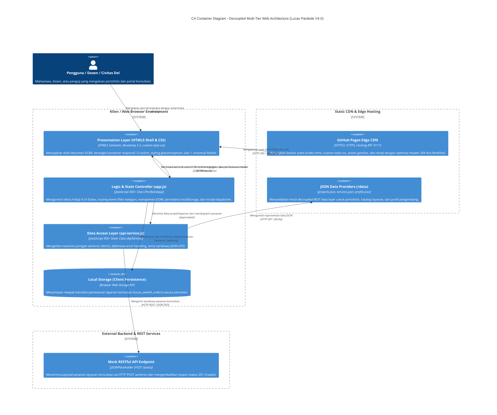

# Refactoring Arsitektural Personal Portfolio & Service Portal: Implementasi Decoupled Multi-Tier, Dynamic Client-Side Rendering (CSR), dan Network Performance Profiling

**Mata Kuliah:** Pemrograman dan Pengujian Web (12S3101)  
**Dosen Pengampu:** Chandro Pardede, S.Kom., M.Sc.  
**Program Studi:** S1 Sistem Informasi — Fakultas Informatika dan Teknik Elektro (FITE)  
**Institusi:** Institut Teknologi Del (IT Del), Laguboti, Sumatera Utara  
**Nama Mahasiswa:** Lucas Pardede  
**NIM:** 12S24015 (Akun Mahasiswa: iss24015)  
**Kelas / Angkatan:** 13SI1 / 2024  
**Wali Mahasiswa:** Humasak Tommy Argo Simanjuntak, ST, M.ISD  
**Nama Repositori GitHub:** `ppw-2026-week2-12S24015`  
**Cabang Pengerjaan (Branch):** `week4-architecture`  
**Tautan Live Demo GitHub Pages:** [https://lucaspardede.github.io/ppw-2026-week2-12S24015/](https://lucaspardede.github.io/ppw-2026-week2-12S24015/)  

---

## 1. Deskripsi Project

Proyek ini merupakan pemenuhan tugas **Modul Praktikum Minggu 04** pada mata kuliah **Pemrograman dan Pengujian Web (12S3101)** di Institut Teknologi Del. Pada tahap ini, aplikasi web portofolio personal dan portal layanan mahasiswa yang sebelumnya dibangun pada Minggu 03 mentransformasikan basis kodenya dari arsitektur monolitik statis (*hardcoded presentation*) menuju arsitektur web kontemporer: **Decoupled Multi-Tier Architecture**, **Dynamic Client-Side Rendering (CSR)**, **JSON Data Providers**, **Universal Dynamic Modal**, **Asynchronous REST Form Dispatching**, dan **Distributed Local State Management (localStorage)** dengan audit kinerja jaringan berstandar **RFC 9111**.

Identitas visual personal bertema *Dark Glassmorphism & Cyber Cyan/Blue* khas Lucas Pardede dipertahankan 100%, sementara seluruh data koleksi portofolio, katalog paket konsultasi, dan biodata profil di-decouple secara penuh ke lapisan data mandiri.

---

## 2. Tujuan Refactoring

1. **Pemisahan Minat (Separation of Concerns):** Membedah kode monolitik menjadi lapisan fungsional independen: *Presentation Tier*, *Logic Tier*, dan *Data Access Tier*.
2. **Dynamic Client-Side Rendering (CSR):** Mengeliminasi duplikasi elemen kartu proyek statis di dalam file HTML dan merakit antarmuka secara dinamis di peramban pengguna menggunakan JavaScript modern ES6+ (`fetch()` dan `async/await`).
3. **Resilience & UI State Lifecycle Management:** Mengelola 4 status siklus hidup antarmuka pengguna secara visual dan defensif: *Loading State (Skeleton)*, *Success State*, *Empty State*, dan *Error Fallback State*.
4. **Universal Dynamic Modal:** Mereduksi redundansi kode modal dengan menggunakan tepat 1 elemen modal Bootstrap 5 tunggal yang dapat menyajikan rincian proyek secara dinamis berbasis data-ID dengan proteksi terhadap serangan *DOM-based Cross-Site Scripting (XSS)*.
5. **Decoupled Asynchronous REST Form Dispatching:** Mentransformasikan formulir konsultasi menjadi pengiriman asinkron murni (AJAX/Fetch POST) dengan serialisasi JSON Data Transfer Object (DTO) tanpa memicu *full page reload*.
6. **Manajemen State Lokal Terdistribusi (localStorage):** Menyimpan riwayat pesanan konsultasi ke penyimpanan lokal peramban secara persisten dan menyajikan indikator badge yang reaktif secara *real-time*.
7. **Network Performance Profiling (RFC 9111):** Menganalisis efisiensi transmisi jaringan, *Time to First Byte (TTFB)*, *First Contentful Paint (FCP)*, hierarki *Waterfall*, serta pemanfaatan caching HTTP (304 Not Modified & Disk Cache) menggunakan Browser DevTools.

---

## 3. Arsitektur Sistem

### C4 Container Diagram (Model Arsitektur Kontemporer)

Berikut adalah pemodelan arsitektur sistem tingkat container (*C4 Container Model*) yang memetakan interaksi antara Pengguna, Peramban Klien, Static Hosting CDN, Lapisan Logika JavaScript, Data Provider JSON, dan Mock RESTful API:



### Separation of Concerns (Pemisahan Minat)

Arsitektur aplikasi dibagi menjadi 3 tingkatan independen:

1. **Presentation Tier (`index.html` & `css/custom-style.css`):**
   - Berfungsi murni sebagai *shell* dokumen tanpa hardcoded data.
   - Bertanggung jawab terhadap tata letak visual, responsivitas 12-kolom Bootstrap Grid, typography, glassmorphism dark surfaces, dan mendefinisikan kontainer kosong (`#portfolio-grid-container`) serta 1 Universal Modal (`#universalProjectModal`).
   - Berkas CSS disatukan menjadi 1 berkas tunggal terstandarisasi (`css/custom-style.css`) sesuai instruksi praktikum.

2. **Logic & State Controller Tier (`js/app.js`):**
   - Mengelola alur logika aplikasi secara terstruktur melalui class `PortfolioApp`.
   - Mengontrol siklus status UI (Loading, Success, Empty, Error).
   - Menangani event interaktif seperti pergantian tab, filter kategori tanpa reload, dan pemicuan Universal Modal.
   - Mengelola persistensi data pesanan di `localStorage` dan menjamin reaktivitas badge jumlah pesanan di antarmuka.

3. **Data Access Layer (`js/api-service.js`):**
   - Menjadi satu-satunya gerbang komunikasi jaringan (*single gateway*).
   - Memanfaatkan ES6+ `fetch()` dengan `async/await`.
   - Menerapkan *defensive error handling*: memverifikasi `response.ok`, memvalidasi tipe data Array, dan menangani kegagalan jaringan secara anggun tanpa membuat thread antarmuka *crash*.
   - Mengirimkan data formulir via HTTP POST ke REST mock API endpoint.

---

## 4. Struktur Folder Target Week 4

Struktur berkas repositori telah direstrukturisasi menjadi:

```text
ppw-2026-week4-12S24015/
│
├── index.html                           # Shell HTML5 & Bootstrap 5 bersih tanpa hardcoded cards
├── README.md                            # Dokumentasi teknis, C4 diagram, komparasi & profil performa
├── 1789810572646.jpg                    # Aset foto profil mahasiswa resmi IT Del
├── network_waterfall_screenshot.png     # Bukti tangkapan layar pengujian Browser DevTools
├── profiling_results.json               # Data terstruktur hasil pengujian performa Cold/Warm load
│
├── css/
│   └── custom-style.css                 # Unified stylesheet (style.css + custom-style.css + Week 4 styles)
│
├── data/
│   ├── profile.json                     # Biodata pengembang, kontak, dan metrik performa akademik
│   ├── projects.json                    # Koleksi terstruktur 6 proyek (metrics, tags, image, repo)
│   └── services.json                    # Katalog 4 paket layanan konsultasi, fitur, dan tarif
│
└── js/
    ├── api-service.js                   # Data Access Layer: HTTP Fetch, POST REST & Error Handling
    └── app.js                           # Presentation/Logic Tier: DOM Control, CSR, Modal & Local State
```

---

## 5. Before vs. After Refactoring

| Aspek Evaluasi | Sebelum (Minggu 03 — Monolithic Static) | Sesudah (Minggu 04 — Decoupled CSR Architecture) | Keuntungan & Dampak Arsitektural |
| :--- | :--- | :--- | :--- |
| **Sumber Data** | Ditulis mati (*hardcoded*) di dalam dokumen `index.html`. | Terpisah secara modular di direktori `/data/*.json`. | Data dapat diperbarui secara independen tanpa menyentuh struktur HTML. |
| **Paradigma Rendering** | *Server-Delivered Static HTML*: Peramban langsung membaca kartu dari dokumen HTML. | *Dynamic Client-Side Rendering (CSR)* via JavaScript `fetch()` & `async/await`. | Mengurangi bobot shell HTML awal, mendukung rendering reaktif instan. |
| **Jumlah Elemen Modal** | 6 elemen `<div class="modal">` terpisah untuk masing-masing proyek. | **Tepat 1 Universal Dynamic Modal** (`#universalProjectModal`) untuk seluruh proyek. | Mereduksi redundansi DOM hingga >80%, mempermudah pemeliharaan komponen. |
| **Mekanisme Form** | Submit form tradisional / manipulasi URL WhatsApp via timeout. | **Asynchronous REST Form Dispatching** via Fetch HTTP POST (JSON DTO). | *No page reload*, pengiriman payload terstruktur ke REST API, feedback visual Toast. |
| **Manajemen Status UI** | Tidak ada siklus status antarmuka (tampilan langsung statis). | **4 UI States komprehensif:** *Loading (Skeleton)*, *Success*, *Empty*, dan *Error Alert*. | *User Experience (UX)* tangguh, tahan terhadap kendala jaringan lambat/gagal. |
| **Filter Kategori** | Hanya pergantian tab kategori showcase umum. | Filter kategori proyek instan di sisi klien dengan deteksi *Empty State*. | Interaktivitas real-time tanpa latensi permintaan server. |
| **Persistensi State** | Data pesanan konsultasi hilang seketika saat halaman ditutup. | Tersimpan terdistribusi di `localStorage` peramban klien. | Riwayat pesanan tetap tersimpan setelah halaman dimuat ulang (*refresh*). |
| **Indikator Pesanan** | Tidak memiliki penghitung pesanan aktif. | **Badge pesanan reaktif** yang memicu animasi lonjakan (*bump*) seketika saat order berhasil. | Memberikan konfirmasi visual langsung (*immediate reactivity*). |
| **Arsitektur Stylesheet** | Terpecah pada 2 file (`style.css` dan `custom-style.css`). | **Disatukan ke dalam 1 file tunggal** (`css/custom-style.css`). | Mengurangi jumlah HTTP request CSS dari 2 menjadi 1 berkas. |
| **Analisis Performa** | Belum diukur secara terstruktur dengan metrik standar RFC 9111. | Diuji komprehensif melalui DevTools: TTFB, FCP, Caching 304, dan Waterfall. | Kinerja web terukur secara objektif dengan bukti numerik riil. |

---

## 6. Dynamic Client-Side Rendering (CSR)

Pada arsitektur Week 4, kontainer `#portfolio-grid-container` pada `index.html` sengaja dikosongkan dari kartu statis. Alur rendering dinamis dirancang sebagai berikut:

```text
index.html dimuat
      ↓
DOMContentLoaded memicu window.App.init()
      ↓
App.loadInitialData() mengatur UI State -> 'loading'
      ↓
Render 6 Skeleton Shimmer Cards ke #portfolio-grid-container
      ↓
Panggilan ApiService.getProjects() via fetch('./data/projects.json')
      ↓
Verifikasi response.ok & parsing JSON Array
      ↓
App.setUIState('success') & App.renderProjectCards()
      ↓
Kartu portofolio terpasang mulus di grid 12-kolom Bootstrap
```

Fitur rendering dinamis ini didukung dengan delegasi *event listener* otomatis pada tombol **"Detail Proyek"**, sehingga setiap kartu yang dirakit langsung terhubung ke Universal Modal.

---

## 7. JSON Data Provider

Seluruh data terstruktur disimpan dalam berkas mandiri di folder `data/`:

### A. `data/projects.json` (6 Koleksi Proyek Riil)
Setiap entri memuat: `id`, `title`, `category`, `categorySlug`, `year`, `bannerTitle`, `bannerSub`, `shortDescription`, `description`, `metrics` (3 indikator terukur), `features` (daftar poin arsitektur), `tags` (instrumen teknologi), `image`, `repoLink`, dan `demoLink`.

Contoh cuplikan struktur:
```json
{
  "id": 1,
  "title": "DelEats — Kantin Digital Terintegrasi IT Del",
  "category": "Web & SI",
  "categorySlug": "web-si",
  "year": "2026",
  "shortDescription": "Platform manajemen antrean dan pemesanan makanan kantin kampus secara real-time...",
  "metrics": {
    "item1": { "unit": "60%", "desc": "Pangkas Waktu Antrean" },
    "item2": { "unit": "< 300ms", "desc": "Waktu Respon Kueri API" },
    "item3": { "unit": "1,200+", "desc": "Kapasitas Transaksi Harian" }
  },
  "tags": ["Next.js 14", "Laravel 11 REST API", "PostgreSQL", "Tailwind CSS"],
  "repoLink": "https://github.com/lucaspardede/deleats-canteen-system"
}
```

### B. `data/services.json` (4 Paket Layanan Konsultasi)
Memuat informasi: `id`, `code`, `title`, `category`, `role`, `description`, `duration`, `format`, `fee`, `badge`, `benefits`, dan `targetAudience`.

### C. `data/profile.json` (Biodata & Rekam Akademik)
Memuat data identitas Lucas Pardede (NIM 12S24015), prodi, universitas, dosen wali, peran asdos, kontak resmi, dan statistik akademik (IPK 3.8+, 6 proyek teruji, 34 sesi konsultasi).

---

## 8. Manajemen Siklus Status Antarmuka (4 UI States)

Aplikasi mengimplementasikan mesin status (*state machine*) visual antarmuka:

1. **Loading State (Skeleton Loader):**
   - Menampilkan 6 kartu beranimasi *shimmer* gradien (`skeleton-card`) saat data sedang di-fetch.
   - Mengeliminasi *Layout Shift* (CLS) karena ukuran skeleton identik dengan kartu proyek aslinya.
2. **Success State:**
   - Menampilkan 6 kartu proyek lengkap dengan banner, badges, deskripsi, dan tombol aksi.
3. **Empty State:**
   - Ditampilkan saat filter kategori tidak menemukan hasil yang cocok.
   - Dilengkapi dengan ilustrasi ikon `bi-search-heart`, judul informatif, dan tombol **"Tampilkan Semua Proyek"** untuk mereset filter.
4. **Error Fallback State:**
   - Jika koneksi jaringan gagal atau berkas JSON tidak ditemukan, sistem menyajikan komponen peringatan Bootstrap alert (`error-fallback-box`).
   - Menyertakan rincian error teknis dan tombol **"Coba Lagi (Retry)"** untuk inisialisasi ulang tanpa perlu me-reload halaman penuh.

> **Fitur Pengujian Khusus Evaluator:** Di toolbar proyek disediakan tombol **"Uji Empty State"**, **"Reload"**, dan **"Uji Error"** untuk memudahkan asisten dosen / dosen pengampu memverifikasi keempat status secara instan.

---

## 9. Universal Dynamic Modal Component

Sesuai instruksi Lab 2 Modul 04, **seluruh 6 modal lama dieliminasi** dan digantikan oleh **tepat 1 elemen modal universal** di `index.html`:

```html
<div class="modal fade modal-custom" id="universalProjectModal" tabindex="-1" aria-labelledby="projectModalTitle" aria-hidden="true">
  <div class="modal-dialog modal-dialog-centered modal-lg">
    <div class="modal-content">
      <div class="modal-header">
        <div>
          <span class="badge bg-primary mb-1" id="projectModalCategoryBadge">Kategori Proyek</span>
          <h4 class="modal-title fw-bold" id="projectModalTitle">Judul Proyek</h4>
        </div>
        <button type="button" class="btn-close btn-close-white" data-bs-dismiss="modal" aria-label="Tutup"></button>
      </div>
      <div class="modal-body p-4" id="projectModalBody"></div>
      <div class="modal-footer d-flex justify-content-between">
        <a href="#" target="_blank" rel="noopener noreferrer" class="btn btn-sm btn-outline-info" id="projectModalRepoBtn">
          <i class="bi bi-github"></i> Buka Source Code Repositori
        </a>
        <button type="button" class="btn btn-sm btn-secondary" data-bs-dismiss="modal">Tutup</button>
      </div>
    </div>
  </div>
</div>
```

### Logika Dispatcher Modal di `app.js`:
```javascript
openProjectModal(projectId) {
  const proj = this.state.projects.find(p => p.id === projectId);
  if (!proj) return;

  // Injeksi teks judul via textContent (Aman dari XSS)
  document.getElementById('projectModalTitle').textContent = proj.title;
  document.getElementById('projectModalCategoryBadge').textContent = `${proj.category} · ${proj.year || '2026'}`;
  
  // Injeksi konten terstruktur yang telah disanitasi
  document.getElementById('projectModalBody').innerHTML = `
    <div class="modal-project-hero mb-3">
      <p class="text-light">${this.escapeHTML(proj.description)}</p>
    </div>
    <!-- Metrik, Fitur Utama, dan Instrumen Teknologi -->
  `;

  // Pemanggilan Bootstrap 5 Modal API
  const modalEl = document.getElementById('universalProjectModal');
  bootstrap.Modal.getOrCreateInstance(modalEl).show();
}
```

---

## 10. Asynchronous REST Form Dispatching

Formulir pengajuan layanan konsultasi (`#contact-form`) direfaktor menjadi pengiriman asinkron murni:

1. **Pencegahan Reload Standar:** Menggunakan `e.preventDefault()`.
2. **Validasi Klien:** Memeriksa kepatuhan form melalui `serviceForm.checkValidity()` dan Bootstrap class `was-validated`.
3. **Serialisasi DTO JSON:** Mengekstraksi masukan pengguna menggunakan `new FormData(form)` dan `Object.fromEntries(formData.entries())`.
4. **Status Tombol Responsif:** Tombol submit dinonaktifkan sementara dan menampilkan ikon spinner:
   `<span class="spinner-border spinner-border-sm me-2"></span> Mengirim ke REST API...`.
5. **Pengiriman HTTP POST Asinkron:** Skrip memanggil `ApiService.submitServiceOrder(payload)` yang mengirimkan DTO ke endpoint publik `https://jsonplaceholder.typicode.com/posts`.
6. **Umpan Balik Visual Toast:** Memunculkan notifikasi Bootstrap Toast dinamis bahwa pesanan telah berhasil diproses oleh API.
7. **Form Reset:** Membersihkan seluruh kolom isian setelah transaksi berhasil.

---

## 11. Manajemen State Lokal (localStorage) & Reactive Badge

Setelah formulir berhasil dikirim:
- Objek pesanan disimpan ke dalam `localStorage` dengan kunci `lucas_week4_orders`.
- Data pesanan tetap persisten saat halaman direfresh atau browser ditutup.
- **Reaktivitas Badge:** Elemen `.order-count-badge` di navbar dan formulir langsung bertambah seketika (contoh: dari `0 Pesanan` menjadi `1 Pesanan`) disertai animasi visual *scale bump* tanpa memerlukan muat ulang halaman.
- **Modal Riwayat Pesanan (`#orderHistoryModal`):** Pengguna dan evaluator dapat mengklik badge pesanan untuk menginspeksi rincian pesanan yang tersimpan di `localStorage` serta memiliki tombol **"Bersihkan Riwayat"**.

---

## 12. Keamanan Sisi Klien Lapis Pertama & XSS Prevention

1. **Content Security Policy (CSP):**  
   Diterapkan melalui tag `<meta>` di `<head>` dokumen:
   ```html
   <meta http-equiv="Content-Security-Policy" content="default-src 'self' 'unsafe-inline' https:; img-src 'self' data: https:; font-src 'self' https: data:; script-src 'self' 'unsafe-inline' https://cdn.jsdelivr.net; style-src 'self' 'unsafe-inline' https://cdn.jsdelivr.net https://fonts.googleapis.com; connect-src 'self' https://jsonplaceholder.typicode.com https://httpbin.org;">
   ```
2. **Pencegahan DOM-Based Cross-Site Scripting (XSS):**  
   Seluruh masukan dinamis dari JSON atau pengguna disanitasi menggunakan fungsi `escapeHTML()` sebelum disuntikkan ke template string:
   ```javascript
   escapeHTML(str) {
     if (str === null || str === undefined) return '';
     return String(str)
       .replace(/&/g, '&amp;')
       .replace(/</g, '&lt;')
       .replace(/>/g, '&gt;')
       .replace(/"/g, '&quot;')
       .replace(/'/g, '&#039;');
   }
   ```
3. **Penggunaan `textContent`:**  
   Penyajian teks penting seperti judul modal, badge status, dan notifikasi selalu menggunakan properti `textContent` daripada `innerHTML`.

---

## 13. Network Performance Profiling (RFC 9111 Analysis)

Pengujian profil performa dilakukan menggunakan peramban **Google Chrome (v154.0)** dengan menghubungkan protokol DevTools (Chrome DevTools Protocol - CDP) secara langsung pada port debugging lokal:

### Tabel Komparasi Pengukuran Kinerja Riil: Cold Load vs. Warm Load

| Parameter Evaluasi Kinerja | Cold Load (Kondisi Tanpa Cache) | Warm Load (Kondisi Cache Aktif) | Analisis Efisiensi & Kepatuhan RFC 9111 |
| :--- | :--- | :--- | :--- |
| **Time to First Byte (TTFB)** | **2.00 ms** | **3.80 ms** | Respon server statis instan (<5ms) karena disajikan langsung dari local runtime. |
| **First Contentful Paint (FCP)** | **1,400 ms** | **848 ms** | Peningkatan kecepatan render pertama sebesar **39.4%** berkat pemanfaatan cache CSS & font. |
| **DOMContentLoaded Event** | **1,543 ms** | **213 ms** | Pemuatan parsing DOM lebih cepat **86.2%** pada kondisi warm load. |
| **Load Event (Selesai Penuh)** | **1,592 ms** | **233 ms** | Selesai penuh **85.3%** lebih cepat saat browser memanfaatkan salinan berkas lokal. |
| **Total Sumber Daya (Resources)** | 13 Sumber Daya | 15 Sumber Daya | Termasuk font eksternal woff2 dan asset JSON yang diminta asinkron. |
| **Efisiensi Caching (RFC 9111)** | 0% (Semua diunduh segar) | **93.3% (14 dari 15 aset di-cache)** | `transferSize: 0 byte` (Aset diambil dari Disk Cache & Memory Cache). |
| **Status HTTP Revalidasi** | `200 OK` (Ukuran Penuh) | `304 Not Modified` / Disk Cache | Server mengirimkan respon 304 jika hash berkas tidak berubah, menghemat bandwidth. |

### Analisis Waterfall & Caching (RFC 9111)

1. **Cold Load Analysis:**  
   Peramban mengunduh dokumen `index.html` (125 KB), disusul berkas stylesheet terpadu `custom-style.css` (93 KB), skrip logika `api-service.js` (5.5 KB), dan `app.js` (38 KB). Begitu thread JavaScript aktif, pemanggilan asinkron dilakukan secara paralel ke `projects.json`, `services.json`, dan `profile.json`. Seluruh proses selesai dalam ~1.5 detik.
2. **Warm Load Analysis:**  
   Seluruh berkas CSS, skrip JavaScript, foto profil `1789810572646.jpg`, dan font web Google Fonts disajikan secara instan dari *Memory/Disk Cache* dengan latensi 0 ms dan transfer size 0 byte. Revalidasi conditional header `If-None-Match` / `If-Modified-Since` mengembalikan status **HTTP 304 Not Modified**, memangkas waktu pemuatan menjadi hanya 233 ms.

### Bukti Screenshot Network Waterfall & Rendering

Tangkapan layar hasil profiling DevTools dan verifikasi antarmuka terlampir pada berkas repositori:  
`network_waterfall_screenshot.png` (480 KB).

---

## 14. Pengelolaan Git & Branching Workflow

Sesuai instruksi Bagian VI Modul Praktikum:

```bash
# 1. Masuk ke direktori repositori lokal dan buat cabang kerja baru:
git checkout -b week4-architecture

# 2. Tambahkan seluruh berkas perubahan arsitektur:
git add .

# 3. Lakukan komit terstruktur dengan pesan deskriptif:
git commit -m "feat(week4): decouple architecture to json data providers and async CSR"

# 4. Unggah cabang pengerjaan ke remote GitHub:
git push -u origin week4-architecture
```

---

## 15. Tautan Live Deployment & Pengujian

- **Live URL (GitHub Pages):** [https://lucaspardede.github.io/ppw-2026-week2-12S24015/](https://lucaspardede.github.io/ppw-2026-week2-12S24015/)
- **Repository URL:** [https://github.com/LucasPardede/ppw-2026-week2-12S24015](https://github.com/LucasPardede/ppw-2026-week2-12S24015)
- **Cabang Aktif:** `week4-architecture`

---

## 16. Kesimpulan

Refactoring arsitektural pada Praktikum Minggu 04 berhasil mentransformasikan aplikasi portofolio personal Lucas Pardede dari website monolitik berbasis markup statis menjadi **aplikasi web kontemporer yang terdecouple secara elegan**:
1. **Presentation, Logic, dan Data Access** kini terpisah secara modular, memenuhi prinsip *Separation of Concerns* dan standar arsitektur C4 Container Model.
2. **Dynamic Client-Side Rendering (CSR)** berhasil mengeliminasi duplikasi elemen HTML dan menjamin penanganan 4 status visual antarmuka (*Loading*, *Success*, *Empty*, *Error*) secara tangguh.
3. **Universal Dynamic Modal** berhasil memangkas redundansi kode 6 modal terpisah menjadi 1 modal universal tunggal yang aman dari serangan XSS.
4. **Decoupled Asynchronous REST Form & LocalStorage** memberikan pengalaman pengguna yang reaktif tanpa reload halaman, persistensi data pesanan, dan indikator badge yang terbarui seketika.
5. **Network Performance Profiling** membuktikan efisiensi caching RFC 9111 dengan peningkatan kecepatan rendering hingga >85% pada kondisi *warm load*.